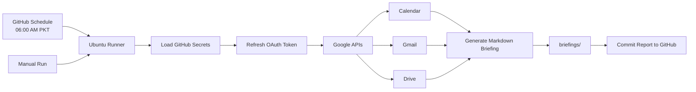

# AI Employee Workspace Backup

[](https://github.com/khanzadigithubid/ai-employee-workspace-backup/actions/workflows/briefing.yml)

This repository contains the backup of the personal AI Agent workspace and configuration for **ClawForge** (Senior AI Engineering Partner) running inside **OpenClaw**.

## Purpose

- **Continuity**: Preserves standing preferences, custom system prompts, developer profile, and memory across agent sessions.
- **Automation & Scheduling**: Stores schedule manifests and task hooks.
- **Integration Scripts & Automations**: Houses helper scripts and automated workflows (e.g., Google Workspace OAuth setup, API testing, and Executive Briefing generation).

## Repository Structure

```text
├── .agents/            # Agent skills and extensions
├── memory/             # Daily engineering logs and notes
├── briefings/          # Generated executive workspace briefings
├── schedules/          # Task and cron manifests
├── AGENTS.md           # Workspace operating instructions
├── IDENTITY.md         # Agent identity & role definition
├── MEMORY.md           # Curated long-term memory & standing preferences
├── SOUL.md             # Persona, tone, and core principles
├── TOOLS.md            # Local environment notes & tool configurations
├── USER.md             # Developer profile & primary technology stack
├── google_workspace_oauth.py # Google Workspace OAuth utility & authentication flow
├── test_google_workspace.py  # API connectivity verification suite
└── workspace_briefing.py     # Automated Google Workspace Executive Briefing generator
```

## Google Workspace Briefing Workflow

The **Google Workspace Briefing Workflow** (`workspace_briefing.py`) is an automated, read-only integration that consolidates key daily activities and productivity data from Google Workspace into a single executive markdown briefing.

### Current Status

- **Automation:** Enabled through GitHub Actions
- **Schedule:** Daily at **06:00 AM Pakistan Standard Time (PKT)**
- **Manual execution:** Available through **Actions → Generate Executive Briefing - Node24 → Run workflow**
- **Output:** `briefings/briefing-YYYY-MM-DD.md`
- **Runtime:** Python 3.12 on GitHub-hosted Ubuntu
- **Google permissions:** Calendar, Gmail, and Drive **read-only** scopes

### Workflow Kaise Kaam Karta Hai

Yeh workflow GitHub Actions par khud-ba-khud run hota hai. Har roz 06:00 AM PKT par GitHub ek temporary Ubuntu machine start karta hai, project code checkout karta hai, Google APIs se fresh data read karta hai, aur nayi briefing report GitHub ke `briefings/` folder mein save karta hai.



**Automatic flow:**

1. GitHub Actions scheduled workflow start karta hai.
2. Python environment aur required Google API packages install hote hain.
3. GitHub Secrets se OAuth credentials securely load hote hain; credentials source code mein save nahi hote.
4. Google Calendar ke upcoming events, Gmail ke unread messages, aur Drive ki recently modified files fetch hoti hain.
5. `briefings/briefing-YYYY-MM-DD.md` report generate hoti hai.
6. GitHub Actions report ko automatically commit karke repository mein push karta hai.

Iska matlab hai ke aapko roz manually script run karne ki zaroorat nahi. Latest report dekhne ke liye repository ke `briefings/` folder ko open karein. Fresh report foran chahiye ho to **Actions → Generate Executive Briefing - Node24 → Run workflow** se manual run kar sakte hain.

### Key Features
- **Google Calendar Integration**: Fetches upcoming scheduled events to highlight key meetings and time-bound commitments.
- **Gmail Integration**: Scans unread messages to surface urgent communications and sender details.
- **Google Drive Integration**: Retrieves recently modified files for quick access and tracking.
- **Executive Output**: Generates cleanly formatted markdown reports saved directly to the `briefings/` directory with timestamps.

### Utility Scripts
- `google_workspace_oauth.py`: Manages secure OAuth authentication and token lifecycle.
- `test_google_workspace.py`: Validates API scopes and connectivity across Calendar, Gmail, and Drive services.

### GitHub Actions Automation

The repository includes `.github/workflows/briefing.yml`. It can be started manually from the **Actions** tab or runs automatically every day at **06:00 AM PKT**. GitHub Actions cron uses UTC, so the configured schedule is `0 1 * * *`.

The workflow:

1. Creates a clean Python 3.12 environment on GitHub-hosted Ubuntu.
2. Loads Google OAuth values from GitHub Actions Secrets without committing them to the repository.
3. Refreshes the short-lived Google access token using the read-only refresh token.
4. Fetches Calendar, Gmail, and Drive data through the official APIs.
5. Saves the generated report under `briefings/`.
6. Commits and pushes only the generated briefing back to the repository.

GitHub may start scheduled workflows a few minutes late during periods of high platform load. The workflow is not instant event streaming; it creates a fresh report on each scheduled or manual run.

Required repository secrets under **Settings → Secrets and variables → Actions**:

| Secret name | Value source |
| --- | --- |
| `GOOGLE_CLIENT_ID` | `client_id` in `google-workspace-token.json` |
| `GOOGLE_CLIENT_SECRET` | `client_secret` in `google-workspace-token.json` |
| `GOOGLE_ACCESS_TOKEN` | `token` in `google-workspace-token.json` |
| `GOOGLE_REFRESH_TOKEN` | `refresh_token` in `google-workspace-token.json` |

The access token is short-lived; the refresh token is what makes scheduled runs continue working. Never commit either token or the client secret to GitHub source files.

### Running Locally

Install the required packages and run the briefing script from the repository root:

```bash
python -m pip install google-api-python-client google-auth-oauthlib google-auth-httplib2 requests
python workspace_briefing.py
```

The local token must be available at:

```text
C:\Users\DELL\.openclaw\secrets\google-workspace-token.json
```

### Troubleshooting

- **Workflow does not appear:** Confirm `.github/workflows/briefing.yml` exists on the `master` branch and refresh the Actions page.
- **Missing secrets:** Add all four required values under **Settings → Secrets and variables → Actions → Repository secrets**. Names must match exactly.
- **OAuth `invalid_grant`:** Generate a new read-only refresh token with `google_workspace_oauth.py` and replace `GOOGLE_REFRESH_TOKEN`.
- **No new report:** Open the latest workflow run and inspect the failed step. The workflow also writes diagnostic details to the run summary.
- **Schedule timing:** GitHub Actions schedules use UTC and can be delayed slightly; the configured target is 06:00 PKT.

### Security Notes

- OAuth credentials are stored only in GitHub Actions Secrets and are never committed to this repository.
- The workflow requests and uses read-only Google scopes.
- Generated reports may contain private calendar, email, and Drive metadata. Keep the repository private if the reports should not be public.

---
*Managed by OpenClaw & ClawForge*
